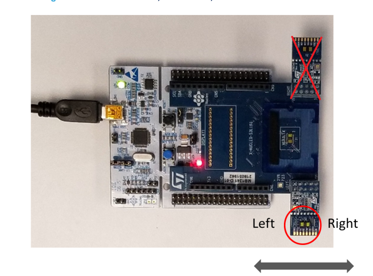

# ESP people counter

This repository contains a program (to be flashed, for example on an ESP32, using the Arduino IDE) which allows to create a sensor capable of detecting people going in and out of a room. It works using the VL53L1X sensor by ST Microelectronics. The passage detection is then shared through the MQTT protocol and the count of the people in the room is done directly on other platform such as Home Assistant (see the dedicated file for a smooth integration in Home Assistant).

## Idea behind the algorithm

The code contains an adaptation of the program  [STSW-IMG10](https://www.st.com/en/embedded-software/stsw-img010.html) (developed by ST Microelectronics), written using the [Sparkfun library for VL53L31X](https://learn.sparkfun.com/tutorials/qwiic-distance-sensor-vl53l1x-hookup-guide/all).  

**The library used is from SparkFun and is made for [their sensor](https://www.sparkfun.com/products/14722), however the same code can also be used alongside the [Pololu VL53L31X sensor](https://www.pololu.com/product/3415).**

The sensor uses the time of flight (ToF) of invisible, eye-safe laser pulses to measure absolute distances independent of ambient lighting conditions  and target characteristics like color, shape, and texture (though these  things will affect the maximum range).  Something is detected in a certain zone, when the distance read by the sensor os lower than the corresponding threshold. 

The idea behind the main algorithm counting for people is the following: after defining two different zones, a passage (entrance or exit) is registered only when:

1. a person is detected in the first zone
2. a person is detected in both zones simultaneously
3. a person is detected in the second zone
4. no person are detected in both zones

Then, depending on which are the first and the second zone, the movement will be either registered as an entrance or an exit. 

## Hardware

### Sensor

As previously stated, the library used to write the code is built for the [Sparkfun Distance Sensor](https://www.sparkfun.com/products/14722), but also works using the [Pololu VL53L31X sensor](https://www.pololu.com/product/3415).
It probably should also work with other VL53L1X sensors, however I've never tried it.

### Board

The following tables contain the necessary wire connections, when using certain boards.

#### 5V boards

(including Arduino Uno, Leonardo, Mega)

```
Arduino   VL53L1X board
-------   -------------
     5V - VIN
    GND - GND
    SDA - SDA
    SCL - SCL
```

The Pololu sensor can also be connetced to 3.3V boards, such as the Arduino Due.

Clearly, to use the MQTT functionalities one has to use a board which supports WiFi connection, such as ESP32: in this case, the connections are the following:

#### ESP32

```
                    ESP32   VL53L1X board
-------------------------   -------------
                      3V3 - VIN
                      GND - GND
     SDA (pin 42, GPIO21) - SDA
     SCL (pin 39, GPIO22) - SCL
```
The sensors from Pololu and Adafruit can also be connected to the 5v pin (VIN)
#### ESP8266
It is also possible to use an ESP8266, using, for example, the following connections: (in that case, use the code specific for this board)
```
                  ESP8266   VL53L1X board
-------------------------   -------------
                      3V3 - VIN
                      GND - GND
                       D2 - SDA
                       D1 - SCL
```

## How to adapt the code to your case

The sensor can be mounted on the top of a door frame or on the side. It has been observed that if the door is wide it is more convenient to mount the sensor on the side.

### WiFi information

In order to connect to the WiFi, one has to specify the name of the WiFi network, its password, the MQTT broker address and ots port, the MQTT username and the corresponding password. All this values have to inserted at the beginning of the code, in the corresponding lines.

### Parameters one might want to set

In the first few lines of the code in the main folder, there are a few parameters which can be modified: (in the parentheses, are indicated the default values)

- `devicename` (name_for_this_device)
- `threshold_percentage` (80)
- `update_raw_measurements` (false)
- `advised_orientation_of_the_sensor` (true)
- `save_calibration_result` (true)
- `short_distance_threshold` (1300)
- `delay_between_measurements_long` (50)
- `time_budget_in_ms_long` (50)
- `delay_between_measurements_short` (20)
- `time_budget_in_ms_short` (20)

Some parameters areavailable only in the ESP32 version. 

#### Name of the device
It indicates the room in which the sensor is going to be positioned. It will simplt change the MQTT topics and will help when multiple sensors are placed around the house.

#### Threshold percentage

After mounting the sensor, it detects automatically the height at which it is situated. When the sensor is working, a person is detected if the distance measured is below a certain threshold, hence defining the right thresholds is pivotal to guarantee a correct functioning of the whole system. It has been observed that having as threshold a value which is 80% of the distance measured in general produces good results, however one might observe that is his sistuation another value of the threshold is better.

#### Update raw measurements
In the initial phase, or when debugging, it can be useful to read the distance measured every 100 ms by the sensor, however in general thish is not useful and produces an useless cinsumption of the resources.
This value has to be set to true if one wants to read the distances measured, however the advice is to hold that to `false`.  
One can change this value through MQTT using the command "update_raw_measurement".

#### Advised orientation of the sensor
This value is going to deterin the center of each zone of detection and has to be true if the sensor is positioned as in the following image:
<p float="left">
  
</p>

The arrow indicates the direction of the people passing under the sensor.

#### Save calibration result
If this value is true, then the results of the calibration of the zones are going to be stored in the EEPROM memory, hence if the ESP is turned off no data is going to be lost. If false, every time the sensor is turned on, a new calibraion is launched, however that is useless if the sensor is always in the same position.
A recalibration can still be called using the MQTT command (see the integration with Home Assistant file)

#### Short distance threshold
When the distane measured in one of the zones is below this threshold (exoressed in millimeters) the sensor uses the short distance mode, which allows more frequent measurements and better performances. The VL53L1X sensor supports short distance mode only if the distance is below 1300 mm

#### Measurements time parameters
These parameters set the time the sensor takes to do a measurements (in milliseconds) and the following delay between two different measurements. The user can define two different values: one for the longRange mode and one for the shortRange mode

### Additional information

Additional information about the parameters used in the code can be found in the `additional_information.md` file in the `manual_configuration` folder


### How to invert the two zones
If you observe that when you get in a room the number of people inside it decreases, while it increases when you get out it means that the values of the centers are inverted. to solve this issue, you can simply invert the values 1 and 2 in the automations which regulate the number of people in the `integration_with_home_assistant.md` file.

### Issues due to sunlight
As stated in the datasheet from the creators of the sensor, the VL53L1X has (much) less accuracy when there is a lot of light. Unfortunately it is not possible to eliminate such issue


## Case for the sensor

In the `case` folder you can find an several stl files created by @noxhirsch for a case that fits both the ESP and the VL53L1X sensor.


## Discord server

If you want to discuss about the idea of finding the ultimate room presence sensor, feel free to join the dedicate Discord server, created by @DutchDeffy: https://discord.gg/65eBamz7AS


